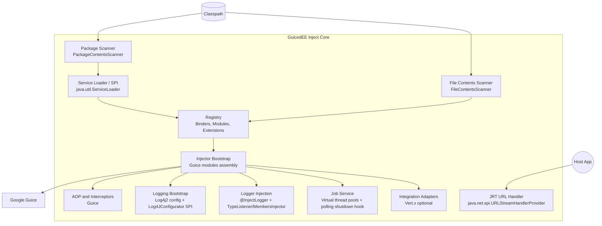

GuicedEE Inject - C4 Level 3 - Component: Inject Core

Notes
- PackageContentsScanner and FileContentsScanner are SPI discovered extension points implemented by host libraries or apps.
- Registry composes discovered Guice binders and modules before handoff to Guice injector creation.
- Logging covers root Log4j2 bootstrap, layout selection (JSON/console), and Log4JConfigurator SPI. Logger injection uses @InjectLogger with a TypeListener + MembersInjector.
- Jobs represents JobService orchestration of virtual-thread pools and polling executors with shutdown hooks.
- URL handler provides a JRT URL stream handler via JPMS service provider.
- Adapters represent optional runtime integrations such as Vert.x provided by sibling libraries.
