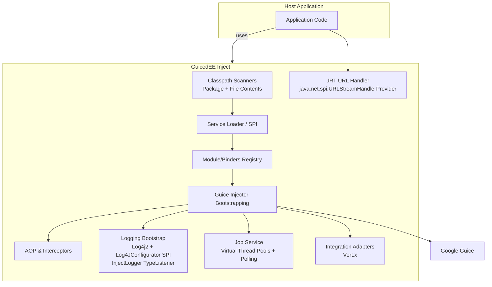

GuicedEE Inject — C4 Level 2 (Container)

```mermaid
flowchart TB
  subgraph Host[Host Application]
    App[Application Code]
  end

  subgraph GEI[GuicedEE Inject]
    Scanner[Classpath Scanners\nPackage + File Contents]
    SPI[Service Loader / SPI]
    Registry[Module/Binders Registry]
    Boot[Guice Injector Bootstrapping]
    AOP[AOP & Interceptors]
    Logging[Logging Bootstrap\nLog4j2 + Log4JConfigurator SPI\nInjectLogger TypeListener]
    Jobs[Job Service\nVirtual Thread Pools + Polling]
    URLHandler[JRT URL Handler\njava.net.spi.URLStreamHandlerProvider]
    Adapters[Integration Adapters\nVert.x]
  end

  Guice[Google Guice]

  App -->|uses| GEI
  Scanner --> SPI --> Registry --> Boot --> Guice
  Boot --> AOP
  Boot --> Adapters
  Boot --> Logging
  Boot --> Jobs
  App --> URLHandler
```
