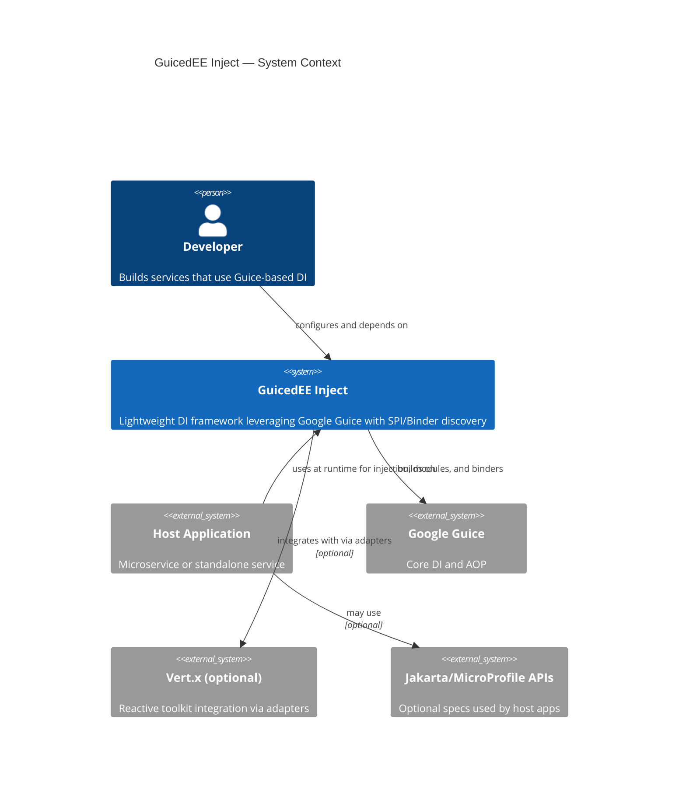

GuicedEE Inject — C4 Level 1 (System Context)

```mermaid
C4Context
title GuicedEE Inject — System Context
Person(dev, "Developer", "Builds services that use Guice-based DI")
System(gei, "GuicedEE Inject", "Lightweight DI framework leveraging Google Guice with SPI/Binder discovery")
System_Ext(app, "Host Application", "Microservice or standalone service")
System_Ext(guice, "Google Guice", "Core DI and AOP")
System_Ext(vertx, "Vert.x (optional)", "Reactive toolkit integration via adapters")
System_Ext(microprofile, "Jakarta/MicroProfile APIs", "Optional specs used by host apps")

Rel(dev, gei, "configures and depends on")
Rel(app, gei, "uses at runtime for injection, modules, and binders")
Rel(gei, guice, "builds on")
Rel(gei, vertx, "integrates with via adapters", "optional")
Rel(app, microprofile, "may use", "optional")
```
