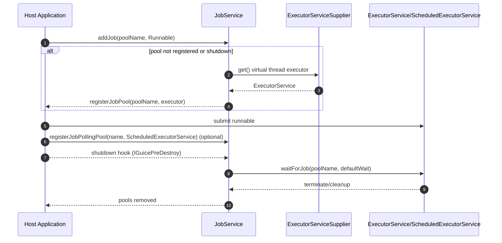

GuicedEE Inject - Sequence: Job Service Lifecycle

Notes
- Uses virtual thread executors by default via ExecutorServiceSupplier.
- Maintains separate maps for one-off jobs and polling tasks; enforces max queue sizes.
- Implements IGuicePreDestroy to drain pools during shutdown, coordinated by Guice lifecycle.
