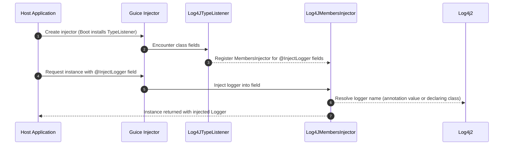

GuicedEE Inject - Sequence: Logger Injection Flow

Notes
- Uses @InjectLogger annotation to mark fields of type `org.apache.logging.log4j.Logger`.
- TypeListener scans class hierarchy for annotated fields and registers MembersInjector.
- Logger names default to declaring class unless overridden by annotation value; integrates with Log4j2 config established at bootstrap (see GuiceContext).
