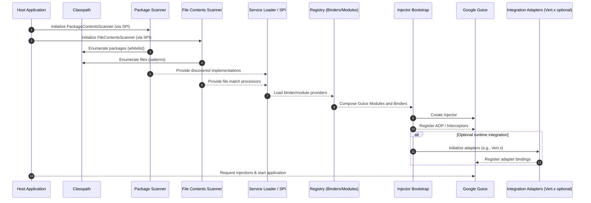

GuicedEE Inject - Sequence: Runtime Injection Lifecycle

Notes
- Package and file scanners contribute discoveries before injector creation.
- ServiceLoader mediates discovery of scanners, binders, and modules.
- Adapters (e.g., Vert.x) are optional and provided by sibling libraries.
