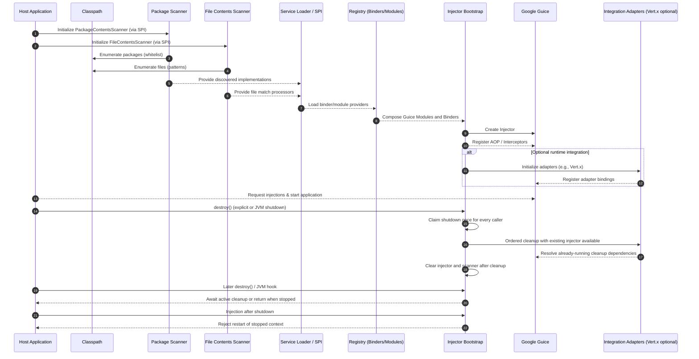

GuicedEE Inject - Sequence: Runtime Injection Lifecycle

```mermaid
sequenceDiagram
    autonumber
    participant App as Host Application
    participant CP as Classpath
    participant PScan as Package Scanner
    participant FScan as File Contents Scanner
    participant SPI as Service Loader / SPI
    participant Reg as Registry (Binders/Modules)
    participant Boot as Injector Bootstrap
    participant Guice as Google Guice
    participant Ad as Integration Adapters (Vert.x optional)

    App->>PScan: Initialize PackageContentsScanner (via SPI)
    App->>FScan: Initialize FileContentsScanner (via SPI)
    PScan->>CP: Enumerate packages (whitelist)
    FScan->>CP: Enumerate files (patterns)
    PScan-->>SPI: Provide discovered implementations
    FScan-->>SPI: Provide file match processors
    SPI-->>Reg: Load binder/module providers
    Reg-->>Boot: Compose Guice Modules and Binders
    Boot->>Guice: Create Injector
    Boot-->>Guice: Register AOP / Interceptors
    alt Optional runtime integration
        Boot->>Ad: Initialize adapters (e.g., Vert.x)
        Ad-->>Guice: Register adapter bindings
    end
    App-->>Guice: Request injections & start application
    App->>Boot: destroy() (explicit or JVM shutdown)
    Boot->>Boot: Claim shutdown once for every caller
    Boot->>Ad: Ordered cleanup with existing injector available
    Ad-->>Guice: Resolve already-running cleanup dependencies
    Boot->>Boot: Clear injector and scanner after cleanup
    App->>Boot: Later destroy() / JVM hook
    Boot-->>App: Await active cleanup or return when stopped
    App->>Boot: Injection after shutdown
    Boot-->>App: Reject restart of stopped context
```

Notes
- Package and file scanners contribute discoveries before injector creation.
- ServiceLoader mediates discovery of scanners, binders, and modules.
- Adapters (e.g., Vert.x) are optional and provided by sibling libraries.
- Shutdown is terminal and idempotent for direct `inject()` callers as well as
  process-launcher callers. Same-thread reentrant cleanup returns immediately;
  concurrent callers await the original cleanup. Startup rollback uses this same
  path. Cleanup can use the existing injector until all destroyers finish, but
  cannot rebuild the injector after it has been cleared.
