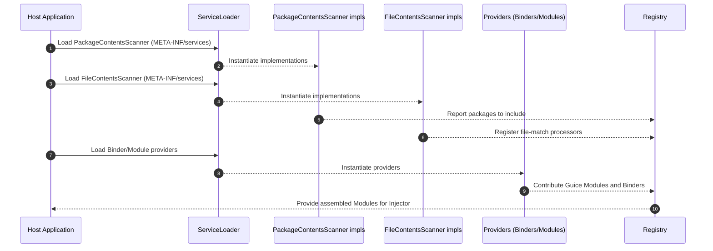

GuicedEE Inject - Sequence: SPI Discovery & Module Loading

Notes
- All discoveries are via java.util.ServiceLoader and classpath scanning.
- Providers abstract library- or app-specific contributions to the injector.
